# 10 — Architecture Diagrams

**Purpose**: Visual representation of the architecture described in [09.architecture.principles.md](09.architecture.principles.md)

**Format**: Mermaid (renders natively in GitHub/markdown)

---

## Diagram 1: Overall System Architecture

```mermaid
graph TB
    subgraph "Client Layer"
        WEB[Web App]
        MOBILE[Mobile App]
        API_CLIENT[API Clients]
    end

    subgraph "API Layer (Instant Tier < 500ms)"
        API[FastAPI Gateway]
        INSTANT[Instant Workers]

        API --> INSTANT
        INSTANT --> NORM[Artifact Normalizer]
        INSTANT --> LANG[Language Detector]
        INSTANT --> MATCH[Fast Entity Matcher]
        INSTANT --> STUB[Stub Creator]
    end

    subgraph "Storage Layer (Single Source of Truth)"
        PG[(PostgreSQL<br/>Artifacts, Content,<br/>Entities, Events)]
        NEO[(Neo4j<br/>Graph Edges<br/>+ Confidence)]
        REDIS[(Redis<br/>Cache + Queues)]
    end

    subgraph "Lazy Tier (Async Workers)"
        Q[Priority Queues]

        subgraph "Tier 1: Content (2-10s)"
            URL_EXT[URL Extractor]
            IMG_EXT[Image Extractor]
            VID_EXT[Video Extractor]
        end

        subgraph "Tier 2: Entities (3-15s)"
            NER[NER Pipeline]
            FUZZY[Fuzzy Matcher]
            CROSS[Cross-Lang Linker]
        end

        subgraph "Tier 3: Claims (5-20s)"
            CLAIM[Claim Extractor]
            FACT[Fact Checker]
        end

        subgraph "Tier 4: Events (10-30s)"
            CLUSTER[Event Clusterer]
            MERGE[Cross-Lang Merger]
        end

        subgraph "Tier 5: Enrichment (mins-hrs)"
            WD[Wikidata Enricher]
            ALIAS[Alias Discoverer]
            CONF[Confidence Recomputer]
            RESOLVE[Conflict Resolver]
        end
    end

    %% Connections
    WEB --> API
    MOBILE --> API
    API_CLIENT --> API

    API --> PG
    API --> REDIS
    INSTANT --> PG
    INSTANT --> REDIS

    REDIS --> Q
    Q --> URL_EXT
    Q --> IMG_EXT
    Q --> NER
    Q --> CLAIM
    Q --> CLUSTER
    Q --> WD
    Q --> CONF
    Q --> RESOLVE

    URL_EXT --> PG
    NER --> PG
    NER --> NEO
    CLUSTER --> PG
    CLUSTER --> NEO
    CONF --> NEO
    RESOLVE --> NEO

    style API fill:#4CAF50
    style INSTANT fill:#8BC34A
    style PG fill:#2196F3
    style NEO fill:#FF9800
    style REDIS fill:#F44336
    style Q fill:#9C27B0
```

---

## Diagram 2: URL Submission Flow (Resource-First Pattern)

---

## Diagram 3: Entity Extraction Flow (Multi-Language)

---

## Diagram 4: Event Clustering (Cross-Language)

---

## Diagram 5: Conflict Resolution (Weighted Voting)

---

## Diagram 6: Entity Confidence Evolution (State Machine)

---

## Diagram 7: Worker Priority & Dependencies

---

## Diagram 8: Data Model (Simplified)

---

## How to Use These Diagrams

### For Documentation
- Copy Mermaid code blocks into GitHub issues, PRs, or docs
- They render automatically in GitHub markdown

### For Presentations
- Use GitHub's rendered view
- Or export to PNG/SVG via [Mermaid Live Editor](https://mermaid.live/)

### For Editing
- [Mermaid Live Editor](https://mermaid.live/) - Real-time preview
- VS Code + Mermaid extension
- Or edit directly in markdown

### For Complex Diagrams
If you need more visual control (colors, grouping, annotations):
- Use [draw.io](https://app.diagrams.net/)
- Import Mermaid as starting point
- Export as `.drawio` or `.svg`
